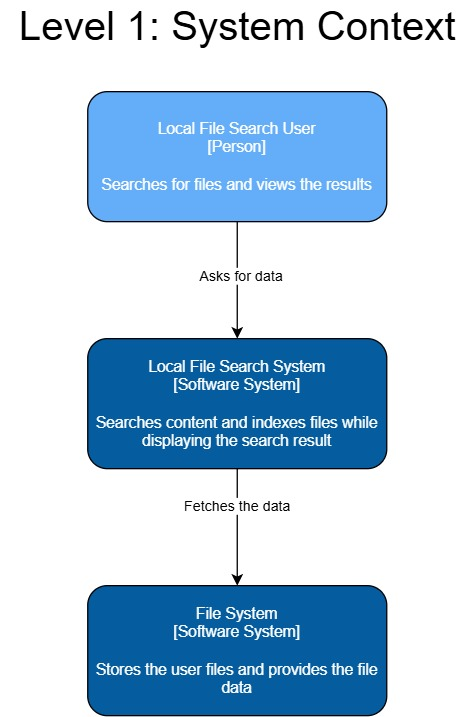
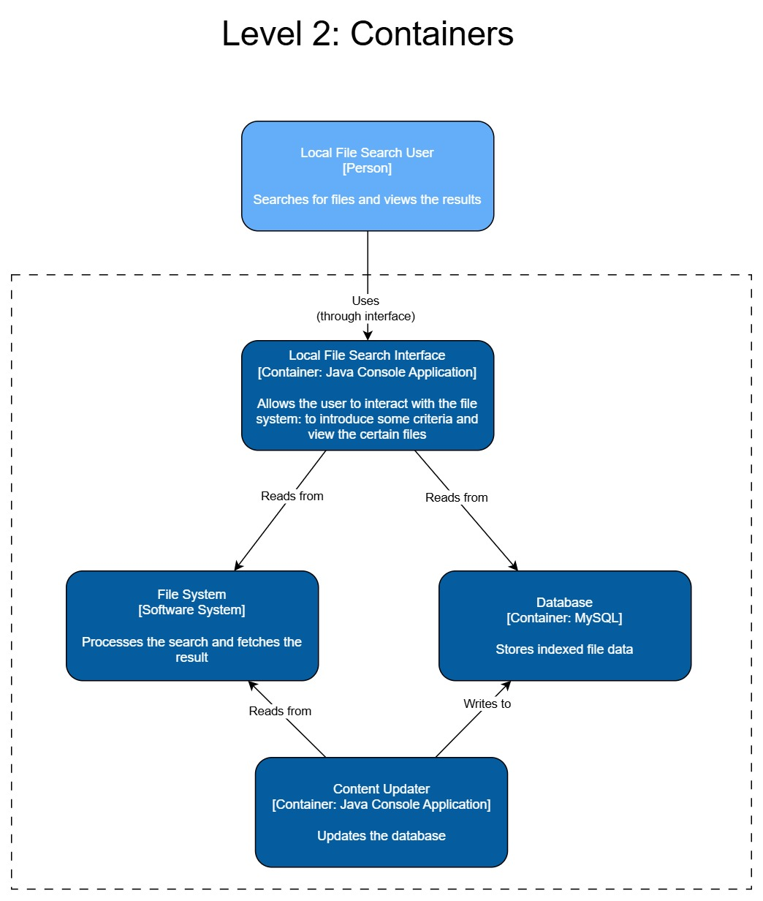
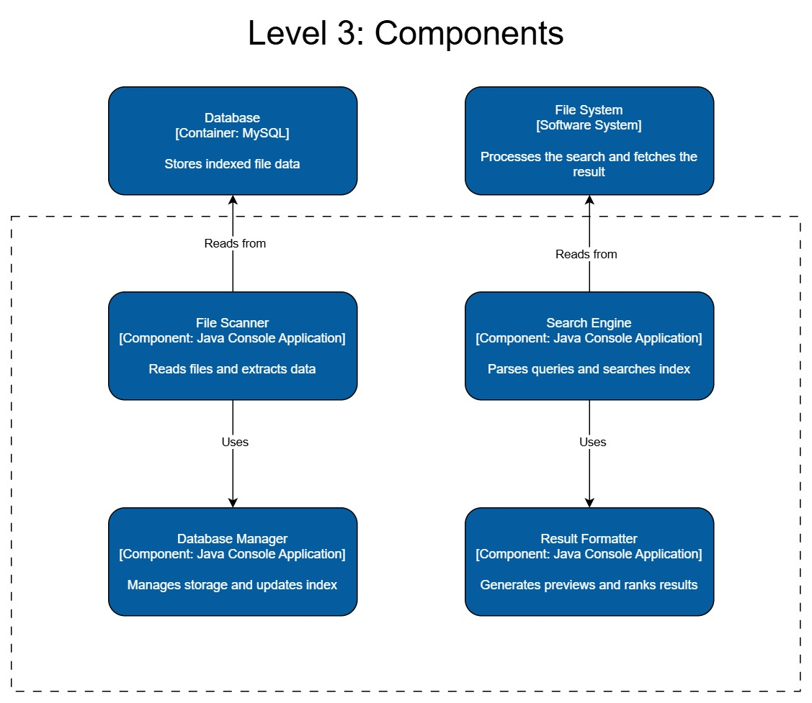

# File Search System - Architecture

### 1. System Overview
A local file system that indexes files and uses
their name and content for finding and displaing the
wanted data

### 2. C4 model Architecture:
#### 2.1 System context diagram

#### 2.2 Containers diagram

#### 2.3 Components diagram
